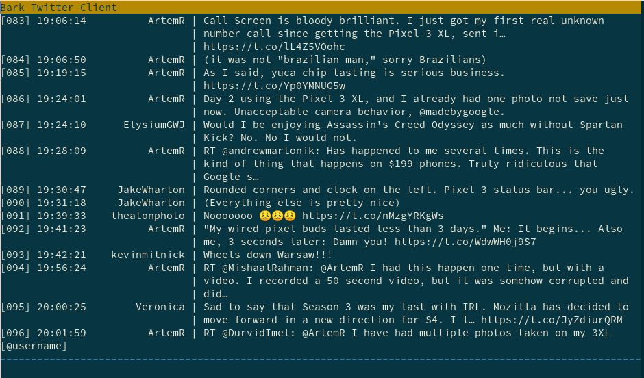

# Bark - The Twitter timeline in your terminal


# Project Status
[](https://circleci.com/gh/jfm/bark)

## Installation
To  try out Bark do the following
```shell
$ git clone https://github.com/jfm/bark.git
$ cd bark
$ pipenv install
$ pipenv run python Bark.py
```
This should be easier in the future but for now this should work

### Dependencies
[python-twitter](https://github.com/bear/python-twitter)

## Commands
For now the following commands have been implemented

```
/refresh - Refreshes the timeline
/tweet [message] - Tweets the message after the command.
/exit - Exits the application
```

## Development
To code on Bark you should be able to just do:

```shell
$ git clone https://github.com/jfm/bark.git
$ cd bark
$ pipenv install --dev
```

### Twitter API keys
The best way to develop on Bark is to use your own consumer key/secret. Obtain those by creating a twitter application [developer](https://apps.twitter.com/)
